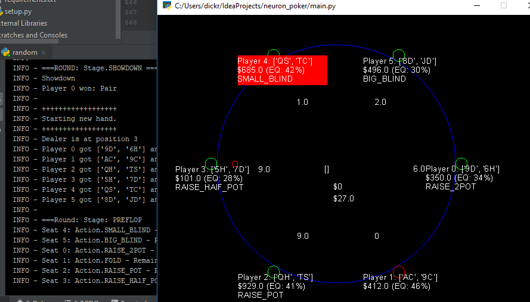
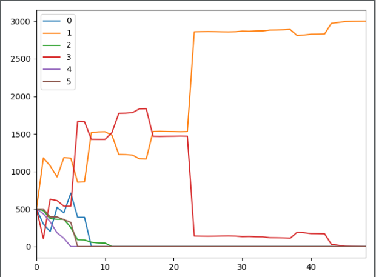
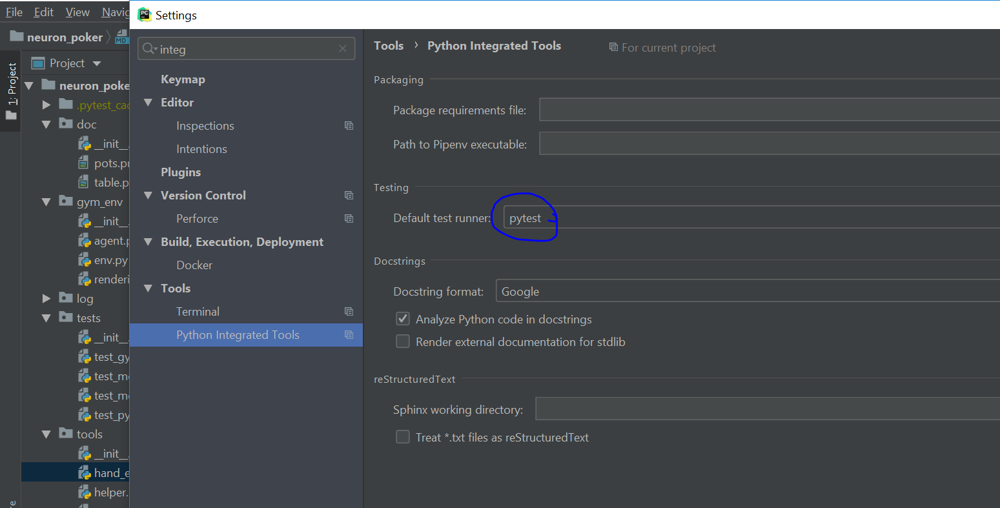

# Neuron Poker: OpenAi gym environment for texas holdem poker

This is an environment for training neural networks to play texas holdem.
Please try to model your own players and create a pull request so we can collaborate
and create the best possible player.

## Usage:
Run:

* Install Anaconda, I would also recommend to install pycharm. 
* Build the virtual python environment by running build_venv.bat
* Run 6 random players playing against each other:
`main.py random --render`

### Packages and modules:
main.py: entry point and command line interpreter. Runs agents with the gym.

#### gym_env
* `random_agent.py`: an agent making random decisions a
* `env.py`: Texas Hold’em unlimited openai gym environment 
& `rendering.py`: rendering graphics while playing

#### tools
* `hand_evaluator.py`: evaluate the best hand of multiple players
* `helper.py`: helper functions
* `montecarlo_numpy2.py`: fast nymph based montecarlo simulation to calculate equity.
* `montecarlo_python.py`: slow python based montecarlo. Supports preflight ranges for other players. 

#### tests
* `test_gym_env.py`: tests for the end. 
* `test_montecarlo.py`: tests for the hands evaluator and python based equity calculator. 
* `test_montecarlo_numpy.py`: tests for the numpy montecarlo
* `test_pylint.py`: pylint and pydoc tests to ensure pep8 standards

### How to contribute

#### Launching
In `main.py` an agent is launched as follows (here adding 6 random agents to the table).
To edit what is accepted to main.py via command line, simply add another line in the
docstring at the top of main.py.

    def random_action(render):
        """Create an environment with 6 random players"""
        n_players = 6
        env = HoldemTable(n_players)
        for _ in range(n_players):
            player = Player(500)
            env.add_player(player)
        env.reset()
    
        while True:
            _, _, done, _ = env.step()
            if render:
                env.render()
            if done:
                break

#### Adding a new model / agent
An example agent can be seen in random_agent.py

To build a new agent, an agent needs to be created, where the follwing function is modified.
You will need to use the observation parameter, which contains the current state of the table,
the players and and the agent itself, as a parameter to determine the best action.

    def action(self, action_space, observation):  # pylint: disable=no-self-use
        """Mandatory method that calculates the move based on the observation array and the action space."""
        _ = observation  # not using the observation for random decision
        this_player_action_space = {Action.FOLD, Action.CHECK, Action.CALL, Action.RAISE_POT, Action.RAISE_HAlF_POT}
        possible_moves = this_player_action_space.intersection(set(action_space))
        action = random.choice(list(possible_moves))
        return action

#### Observation
The state is represented as a numpy array that contains the following information:

    class CommunityData:
        def __init__(self, num_players):
            self.current_player_position = [False] * num_players  # ix[0] = dealer
            self.stage = [False] * 4  # one hot: preflop, flop, turn, river
            self.community_pot: float: the full pot of this hand
            self.current_round_pot: float: the pot of funds added in this round
            self.active_players = [False] * num_players  # one hot encoded, 0 = dealer
            self.bb
            self.sb
    
    
    class StageData:  # as a list, 8 times:
        """Preflop, flop, turn and river, 2 rounds each"""
    
        def __init__(self, num_players):
            self.calls = [False] * num_players  # ix[0] = dealer
            self.raises = [False] * num_players  # ix[0] = dealer
            self.min_call_at_action = [0] * num_players  # ix[0] = dealer
            self.contribution = [0] * num_players  # ix[0] = dealer
            self.stack_at_action = [0] * num_players  # ix[0] = dealer
            self.community_pot_at_action = [0] * num_players  # ix[0] = dealer
    
    
    class PlayerData:
        "Player specific information"
    
        def __init__(self):
            self.position: one hot encoded, 0=dealer
            self.equity_to_river: montecarlo
            self.equity_to_river_2plr: montecarlo
            self.equity_to_river_3plr: montecarlo
            self.stack: current player stack

#### Final analysis:
At the end of the game the performance of the players can be observed.

#### Github
It will be hard for one person alone to beat the world at poker. 
That's why this repo aims to have a collborative environment,
where models can be added and evaluated.

To contribute do the following:
* Get Pycharm and build the virtual python environment. Use can do: `pip install -r requirements.txt`
* Clone your fork to your local machine. You can do this directly from pycharm: VCS --> check out from version control --> git 
* Add as remote the original repository where you created the fork from and call it upstream (your fork will be called origin).
This can be done with vcs --> git --> remotes
* Create a new branch: click on master at the bottom right, and then click on 'new branch'
* Make your edits.
* Ensure all tests pass. Under file --> settings --> python integrated tools switch to pytest (see screenshot).

You can then just right click on the tests folder and run all tests. All tests need to pass. Make sure to add your own tests by simply naming the funtion test_...
* Commit your changes (CTRL+K} 
* Push your changes to your origin (your fork) (CTRL+SHIFT+K)
* To bring your branch up to date with upstream master, if it has moved on: rebase onto upstream master:
click on your branch at the bottom right, then click on upstream/master, then rebase onto. Then make sure to force-push (ctrl+shift+k), 
then select the dropdown next to push and choose force-push (important: don't push and merge a rebased branch with your remote)
* Create a pull request on your github.com to merge your branch with the upstream master. 
* When your pull request is approved, it will be merged into the upstream/master.
* Only pull requests where all the tests are passing can be approved. Best run pytest as described above (in pycharm just right click on the tests folder and run it)

## Current league table
* Random player